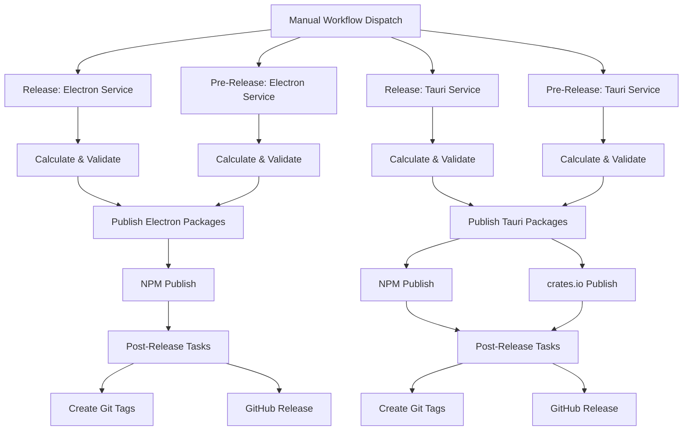

# Release Infrastructure for Electron and Tauri Services

## Overview

Implement service-grouped release workflows for `@wdio/electron-service` and `@wdio/tauri-service`, allowing independent versioning and releases for each service family. The system will support regular releases (patch/minor/major) and pre-releases (prepatch/preminor/premajor/prerelease) using package-versioner, with special handling for the hybrid tauri-plugin package (NPM + crates.io).

## Architecture



## Package Groups

### Electron Service Group (Service Version: v9.2.0 → v10.0.0)

- `@wdio/electron-service` (main service)
- `@wdio/electron-cdp-bridge` (CDP bridge)
- `@wdio/bundler` (app bundler utilities)

### Tauri Service Group (Service Version: v0.0.0 → v1.0.0)

- `@wdio/tauri-service` (main service)
- `@wdio/tauri-plugin` (hybrid Node.js + Rust)

### Shared Packages (Independent Versioning)

- `@wdio/native-utils` (shared utilities, currently v1.0.0)
- `@wdio/native-types` (shared types, currently v1.0.0)

**Versioning Strategy:**

- **Service packages** (electron-service, tauri-service, etc.) follow their service's version
- **Shared packages** (native-utils, native-types) maintain independent semver history
- Shared packages are bumped only when they have actual changes
- Shared packages use semantic versioning based on the nature of changes (breaking/feature/fix)
- Service packages depend on shared packages using semver ranges (e.g., `^1.0.0`)

**Example:**
```
Electron v10.0.0 release:
  - @wdio/electron-service: 9.2.0 → 10.0.0
  - @wdio/native-utils: 1.0.0 → 1.1.0 (if features added)

Tauri v1.0.0 release:
  - @wdio/tauri-service: 0.0.0 → 1.0.0
  - @wdio/native-types: 1.0.0 → 2.0.0 (if breaking changes)
  - @wdio/native-utils: unchanged (if no changes)
```

## Implementation Tasks

### 1. Create Release Scripts

#### 1.1 Version Calculation Script

**File:** `.github/workflows/scripts/calculate-version.ts`

Adapt from zubridge's script with these changes:

- Support service-specific package targeting (`electron`, `tauri`)
- Map service name to service packages and shared packages separately:
  - `electron` → Service: `@wdio/electron-service,@wdio/electron-cdp-bridge,@wdio/bundler`
  - `electron` → Shared: `@wdio/native-utils,@wdio/native-types`
  - `tauri` → Service: `@wdio/tauri-service,@wdio/tauri-plugin`
  - `tauri` → Shared: `@wdio/native-utils,@wdio/native-types`
- Use package-versioner with `--json` output for parsing
- Handle pre-release versions with preid support
- **Detect changes in shared packages** using git diff or commit analysis
- Calculate appropriate bump type for shared packages based on commit messages (conventional commits)
- Set `GITHUB_OUTPUT` for new versions (separate for service vs shared packages)

#### 1.2 NPM Publishing Script

**File:** `.github/workflows/scripts/publish-npm.ts`

Similar to zubridge, but:

- Accept service parameter to determine which packages to publish
- Use `pnpm publish -r --filter` to publish related packages
- Determine NPM tag: `latest` for releases, `next` for pre-releases
- Skip publishing for packages marked as `private: true`

#### 1.3 Crates.io Publishing Script

**File:** `.github/workflows/scripts/publish-crates.sh`

New script for Rust crate publishing:

- Navigate to `packages/tauri-plugin`
- Run `cargo publish --token $CRATES_IO_TOKEN`
- Only runs for tauri service releases
- Verify crate is published successfully

### 2. Create Reusable Workflows

#### 2.1 Calculate Release Workflow

**File:** `.github/workflows/_release-calculate.reusable.yml`

Adapted from existing workflow:

- **Inputs:**
  - `service`: `electron` or `tauri`
  - `branch`: `main`, `feature`, or `maintenance`
  - `release_version`: `patch`, `minor`, `major`, `prepatch`, `preminor`, `premajor`, `prerelease`
- **Outputs:**
  - `target_branch`: Resolved branch name
  - `service_version`: The new version for service packages
  - `shared_packages_changed`: Boolean indicating if shared packages need versioning
  - `shared_version_native_utils`: New version for native-utils (if changed)
  - `shared_version_native_types`: New version for native-types (if changed)
  - `service_package_list`: Comma-separated list of service packages
  - `shared_package_list`: Comma-separated list of changed shared packages
- **Steps:**

  1. Validate release parameters (major releases must be from feature branches)
  2. Determine service package list based on service
  3. Detect changes in shared packages (git diff analysis)
  4. Calculate new service version using calculate-version.ts script
  5. If shared packages changed: Calculate appropriate bump type based on commits
  6. Verify target branch exists
  7. Output all calculated values

#### 2.2 Publish Release Workflow

**File:** `.github/workflows/_release-publish.reusable.yml`

Core publishing workflow:

- **Inputs:**
  - `service`: `electron` or `tauri`
  - `target_branch`: Branch to release from
  - `service_version`: New version for service packages
  - `service_package_list`: Service packages to version/publish
  - `shared_package_list`: Shared packages to version/publish (if any)
  - `shared_version_native_utils`: New version for native-utils (optional)
  - `shared_version_native_types`: New version for native-types (optional)
  - `dry_run`: Boolean for dry-run mode
- **Secrets:**
  - `github_bot_token`: GitHub authentication
  - `deploy_key`: SSH key for git operations
  - `crates_io_token`: crates.io token (for tauri only)
- **Steps:**

  1. Checkout target branch
  2. Setup workspace (Node 20 + pnpm)
  3. Build packages using Turbo
  4. Configure NPM registry
  5. **Bump shared packages first** (if changed):
     - Run package-versioner for native-utils with its calculated version
     - Run package-versioner for native-types with its calculated version
     - Commit and tag shared package versions
  6. **Bump service packages**:
     - Run package-versioner for service packages with service version
     - This will update dependencies on shared packages automatically
     - Commit and tag service version
  7. Publish all bumped packages to NPM using publish-npm.ts
  8. If tauri service: Publish to crates.io using publish-crates.sh
  9. Push all git tags

- **Outputs:**
  - `service_release_tag`: The created service git tag (e.g., `electron-v10.0.0`)
  - `shared_release_tags`: Array of shared package tags (e.g., `native-utils-v1.1.0`)

#### 2.3 Post-Release Workflow

**File:** `.github/workflows/_release-post.reusable.yml`

Post-release cleanup and notifications:

- **Inputs:**
  - `service`: Service that was released
  - `release_tag`: Tag that was created
  - `release_version`: Type of release
  - `dry_run`: Boolean
- **Steps:**

  1. Create GitHub Release with changelog
  2. Update documentation if needed
  3. Notify relevant channels (if configured)

#### 2.4 Orchestration Workflow

**File:** `.github/workflows/_release-orchestration.reusable.yml`

Coordinates the release process:

- **Inputs:**
  - `service`: `electron` or `tauri`
  - `branch`: Branch type
  - `release_version`: Release type
  - `dry_run`: Boolean
- **Jobs:**

  1. `verify_repository`: Ensure running in official repo
  2. `calculate_branches`: Calculate version and validate
  3. `publish_release`: Publish packages
  4. `post_release`: Post-release tasks

### 3. Create Manual Trigger Workflows

#### 3.1 Electron Release Workflow

**File:** `.github/workflows/release-electron.yml`

Manual trigger for electron releases:

- **Workflow Dispatch Inputs:**
  - `branch`: Choice of `main`, `feature`, `maintenance` (default: `main`)
  - `release_version`: Choice of `patch`, `minor`, `major` (default: `patch`)
  - `dry_run`: Boolean (default: `false`)
- **Calls:** `_release-orchestration.reusable.yml` with `service: electron`

#### 3.2 Tauri Release Workflow

**File:** `.github/workflows/release-tauri.yml`

Manual trigger for tauri releases:

- **Workflow Dispatch Inputs:**
  - `branch`: Choice of `main`, `feature`, `maintenance` (default: `main`)
  - `release_version`: Choice of `patch`, `minor`, `major` (default: `patch`)
  - `dry_run`: Boolean (default: `false`)
- **Calls:** `_release-orchestration.reusable.yml` with `service: tauri`

#### 3.3 Electron Pre-Release Workflow

**File:** `.github/workflows/pre-release-electron.yml`

Manual trigger for electron pre-releases:

- **Workflow Dispatch Inputs:**
  - `branch`: Choice of `feature`, `main`, `maintenance` (default: `feature`)
  - `prerelease_version`: Choice of `prepatch`, `preminor`, `premajor`, `prerelease` (default: `prerelease`)
  - `dry_run`: Boolean (default: `false`)
- **Calls:** `_release-orchestration.reusable.yml` with `service: electron`

#### 3.4 Tauri Pre-Release Workflow

**File:** `.github/workflows/pre-release-tauri.yml`

Manual trigger for tauri pre-releases:

- **Workflow Dispatch Inputs:**
  - `branch`: Choice of `feature`, `main`, `maintenance` (default: `feature`)
  - `prerelease_version`: Choice of `prepatch`, `preminor`, `premajor`, `prerelease` (default: `prerelease`)
  - `dry_run`: Boolean (default: `false`)
- **Calls:** `_release-orchestration.reusable.yml` with `service: tauri`

### 4. Update Existing Files

#### 4.1 Update Repository Check

**File:** `.github/workflows/_release-orchestration.reusable.yml`

Change repository check from:

```yaml
if: ${{ github.repository != 'webdriverio-community/wdio-electron-service' }}
```

To:

```yaml
if: ${{ github.repository != 'webdriverio/desktop-mobile-testing' }}
```

#### 4.2 Add Secrets Documentation

**File:** `.github/workflows/README.md`

Update or create README documenting required secrets:

- `DEPLOY_KEY`: SSH deploy key for pushing tags
- `CRATES_IO_TOKEN`: crates.io authentication token for tauri-plugin

### 5. Package-Versioner Configuration

Package-versioner will be invoked with:

- `--bump <type>`: patch, minor, major, prepatch, preminor, premajor, prerelease
- `--json`: JSON output for parsing
- `--target <packages>`: Comma-separated list of scoped package names
- `--dry-run`: (optional) Preview changes without applying

#### Two-Phase Versioning Process

**Phase 1: Bump shared packages (if changed)**

```bash
# If native-utils has changes
pnpm package-versioner \
  --bump patch \
  --json \
  --target @wdio/native-utils

# If native-types has breaking changes
pnpm package-versioner \
  --bump major \
  --json \
  --target @wdio/native-types
```

**Phase 2: Bump service packages**

```bash
# Electron service release
pnpm package-versioner \
  --bump major \
  --json \
  --target @wdio/electron-service,@wdio/electron-cdp-bridge,@wdio/bundler

# Tauri service release (includes Cargo.toml)
pnpm package-versioner \
  --bump minor \
  --json \
  --target @wdio/tauri-service,@wdio/tauri-plugin
```

#### What Package-Versioner Does

1. Update `package.json` versions for all target packages
2. Update `Cargo.toml` version for tauri-plugin (if included in targets)
3. **Automatically update dependency references** in other package.json files
   - When shared packages are bumped, service packages automatically get updated dependencies
   - Example: native-utils bumps from 1.0.0 → 1.1.0, electron-service's `package.json` updates its dependency to `^1.1.0`
4. Create git commit with version bump
5. Create git tag for each package (e.g., `electron-service-v10.0.0`, `native-utils-v1.1.0`)

#### Full Example: Electron v10.0.0 Release

```bash
# Step 1: Shared packages (if changed)
pnpm package-versioner --bump minor --target @wdio/native-utils
# Creates: native-utils-v1.1.0

# Step 2: Service packages
pnpm package-versioner --bump major --target @wdio/electron-service,@wdio/electron-cdp-bridge,@wdio/bundler
# Creates: electron-service-v10.0.0, electron-cdp-bridge-v10.0.0, bundler-v10.0.0
# Updates electron-service dependencies: "@wdio/native-utils": "^1.1.0"
```

## Release Process Flow

### Regular Release (e.g., Electron v10.0.0)

1. Developer navigates to Actions → "Release: Electron Service"
2. Selects branch: `main`, release type: `major`, dry_run: `false`
3. Workflow runs:

   **Calculate Phase:**
   - Analyzes changes in electron service packages
   - Detects changes in shared packages (native-utils, native-types)
   - Calculates service version: 9.2.0 → 10.0.0
   - Calculates shared versions (if changed):
     - native-utils: 1.0.0 → 1.1.0 (minor - new features)
     - native-types: unchanged (no changes)

   **Publish Phase:**
   - Builds all packages with Turbo
   - Bumps shared packages first:
     - Runs `package-versioner --bump minor --target @wdio/native-utils`
     - Creates tag: `native-utils-v1.1.0`
   - Bumps service packages:
     - Runs `package-versioner --bump major --target @wdio/electron-service,@wdio/electron-cdp-bridge,@wdio/bundler`
     - Updates electron-service deps: `"@wdio/native-utils": "^1.1.0"`
     - Creates tags: `electron-service-v10.0.0`, `electron-cdp-bridge-v10.0.0`, `bundler-v10.0.0`
   - Publishes all to NPM with `latest` tag
   - Pushes all git tags to GitHub
   - Creates GitHub Release with changelog

### Pre-Release (e.g., Tauri v1.0.0-beta.1)

1. Developer navigates to Actions → "Pre-Release: Tauri Service"
2. Selects branch: `feature`, prerelease type: `prerelease`, dry_run: `false`
3. Workflow runs:

   **Calculate Phase:**
   - Analyzes changes in tauri service packages
   - Detects breaking changes in native-types
   - Calculates service version: 0.0.0 → 1.0.0-beta.0
   - Calculates shared versions (if changed):
     - native-types: 1.0.0 → 2.0.0-beta.0 (major - breaking changes)
     - native-utils: unchanged

   **Publish Phase:**
   - Builds all packages with Turbo
   - Bumps shared packages first:
     - Runs `package-versioner --bump premajor --target @wdio/native-types`
     - Creates tag: `native-types-v2.0.0-beta.0`
   - Bumps service packages:
     - Runs `package-versioner --bump prepatch --target @wdio/tauri-service,@wdio/tauri-plugin`
     - Updates tauri-service deps: `"@wdio/native-types": "^2.0.0-beta.0"`
     - Creates tags: `tauri-service-v1.0.0-beta.0`, `tauri-plugin-v1.0.0-beta.0`
   - Publishes all to NPM with `next` tag
   - Publishes tauri-plugin to crates.io
   - Pushes all git tags to GitHub
   - Creates GitHub Pre-Release

## Dry Run Mode

All workflows support dry-run mode:

- Calculates versions
- Shows what would be published
- Does NOT create tags, publish packages, or push changes
- Useful for testing and validation

## Git Tagging Strategy

### Service Package Tags
- Electron service: `electron-service-v10.0.0`
- Tauri service: `tauri-service-v1.0.0`
- CDP bridge: `electron-cdp-bridge-v10.0.0`
- Tauri plugin: `tauri-plugin-v1.0.0`
- Pre-releases: `electron-service-v10.0.0-beta.1`, `tauri-service-v1.0.0-alpha.2`

### Shared Package Tags
- Native utils: `native-utils-v1.1.0`
- Native types: `native-types-v2.0.0`
- Pre-releases: `native-utils-v1.1.0-beta.0`

### Tag Naming Convention

Format: `<package-name>-v<version>`

**Examples:**
- `electron-service-v10.0.0` - Electron main service
- `native-utils-v1.1.0` - Shared utilities (released with Electron)
- `tauri-service-v1.0.0` - Tauri main service
- `native-types-v2.0.0` - Shared types (released with Tauri)

This strategy allows:
- ✅ Independent versioning per package
- ✅ Clear identification of which package a tag belongs to
- ✅ Multiple packages released in same commit have multiple tags
- ✅ Git history shows exact version for each package

## Determining Shared Package Bump Types

When shared packages (`native-utils`, `native-types`) have changes, the system needs to determine the appropriate version bump. This is done through:

### Change Detection

```bash
# Detect if shared packages changed since last release
git diff --name-only <last-tag>..HEAD | grep "packages/native-utils"
git diff --name-only <last-tag>..HEAD | grep "packages/native-types"
```

### Bump Type Calculation

**Option 1: Conventional Commits (Recommended)**

Parse commit messages for shared package changes:
- `feat:` or `feat(native-utils):` → **minor** bump
- `fix:` or `fix(native-types):` → **patch** bump
- `BREAKING CHANGE:` or `!` → **major** bump

**Option 2: Manual Override (Fallback)**

If conventional commits aren't used or commits are ambiguous:
- Default to **patch** for shared packages
- Workflow can include optional input to override shared package bump type

**Option 3: Always Patch (Simplest)**

- Shared packages always use **patch** bump when changed
- Service packages drive major/minor versions
- ⚠️ Less semantically correct but simpler

### Recommended Approach

Use **Conventional Commits** with fallback to **patch**:

```typescript
function determineSharedPackageBump(packagePath: string, lastTag: string): string {
  const commits = getCommitsSince(lastTag, packagePath);

  // Check for breaking changes
  if (commits.some(c => c.includes('BREAKING CHANGE') || c.includes('!'))) {
    return 'major';
  }

  // Check for features
  if (commits.some(c => c.startsWith('feat'))) {
    return 'minor';
  }

  // Default to patch for any changes
  return 'patch';
}
```

### Example Scenarios

**Scenario 1: Add new utility function**
- Commit: `feat(native-utils): add createLogger function`
- Result: native-utils bumped **minor** (1.0.0 → 1.1.0)

**Scenario 2: Fix type definition**
- Commit: `fix(native-types): correct TauriServiceAPI return type`
- Result: native-types bumped **patch** (1.0.0 → 1.0.1)

**Scenario 3: Breaking API change**
- Commit: `feat(native-utils)!: rename getAppInfo to getBinaryInfo`
- Result: native-utils bumped **major** (1.0.0 → 2.0.0)

**Scenario 4: No changes**
- No commits affecting shared packages
- Result: Shared packages **not versioned** in this release

## Key Differences from Zubridge

1. **No Feature Branch Management**: Simpler model without automatic feature branch creation
2. **Service Grouping**: Two independent release pipelines (electron, tauri)
3. **Hybrid Package Support**: Handles NPM + Cargo publishing for tauri-plugin
4. **Independent Shared Package Versioning**: Native-utils and native-types maintain their own semver history independent of service versions
5. **Two-Phase Versioning**: Shared packages are bumped first, then service packages (to update dependencies automatically)
6. **Per-Package Git Tags**: Each package gets its own tag (e.g., `electron-service-v10.0.0`, `native-utils-v1.1.0`)
7. **Conventional Commit Detection**: Automatically determines shared package bump types from commit messages
8. **Simpler Branch Model**: Main, feature, and maintenance (no custom branch naming)

## Testing Strategy

Before using in production:

1. **Test dry-run mode for both services**
   - Verify version calculation logic
   - Ensure no actual commits/tags are created

2. **Test independent versioning for shared packages**
   - Make changes to native-utils only
   - Verify it gets appropriate bump (patch/minor/major)
   - Verify service packages update their dependencies correctly
   - Confirm native-types version remains unchanged

3. **Test service release without shared package changes**
   - Verify only service packages are versioned
   - Confirm shared packages are skipped
   - Ensure service packages keep existing shared package dependencies

4. **Test simultaneous service + shared package release**
   - Make changes to both service and shared packages
   - Verify two-phase versioning (shared first, then service)
   - Confirm dependency updates flow correctly

5. **Verify package-versioner correctly updates all package.json files**
   - Check version bumps in target packages
   - Check dependency updates in dependent packages
   - Verify Cargo.toml updates for tauri-plugin

6. **Test pre-release flow on a feature branch**
   - Verify pre-release versions (beta/alpha)
   - Confirm NPM publishes with `next` tag

7. **Test full release flow on main branch**
   - Verify Git tags are created per-package
   - Confirm NPM publishes with `latest` tag
   - Verify GitHub releases are created

## Required GitHub Secrets

Must be configured in repository settings:

- `DEPLOY_KEY`: SSH deploy key (read/write access for pushing tags)
- `CRATES_IO_TOKEN`: crates.io API token (for tauri-plugin publishing)

## Future Enhancements

- Automatic changelog generation from commit messages
- Slack/Discord notifications on release
- Automated documentation updates
- Release candidates workflow
- Automated dependency updates between packages

## Shared Package Versioning Decision Tree

```
Release Electron Service v10.0.0
│
├─ Check: Has native-utils changed since last release?
│  ├─ YES → Analyze commits
│  │         ├─ Breaking? → major bump (1.0.0 → 2.0.0)
│  │         ├─ Feature?  → minor bump (1.0.0 → 1.1.0)
│  │         └─ Fix?      → patch bump (1.0.0 → 1.0.1)
│  └─ NO  → Skip versioning
│
├─ Check: Has native-types changed since last release?
│  ├─ YES → Analyze commits (same logic as above)
│  └─ NO  → Skip versioning
│
└─ Bump service packages
   ├─ electron-service: 9.2.0 → 10.0.0
   ├─ electron-cdp-bridge: 9.2.0 → 10.0.0
   └─ bundler: 9.2.0 → 10.0.0

   Update dependencies in service packages:
   - "@wdio/native-utils": "^1.1.0" (if bumped)
   - "@wdio/native-types": "^1.0.0" (if unchanged)
```

### Example: Mixed Scenario

**Context:** Releasing Electron v10.0.0

**Changes since last release:**
- `packages/electron-service/`: Added new feature
- `packages/native-utils/`: Fixed bug in logger
- `packages/native-types/`: No changes

**Versioning actions:**
1. ✅ native-utils: 1.0.0 → 1.0.1 (patch)
2. ⏭️  native-types: stays at 1.0.0 (no changes)
3. ✅ electron-service: 9.2.0 → 10.0.0 (major - as requested)
4. ✅ electron-cdp-bridge: 9.2.0 → 10.0.0 (follows service)
5. ✅ bundler: 9.2.0 → 10.0.0 (follows service)

**Tags created:**
- `native-utils-v1.0.1`
- `electron-service-v10.0.0`
- `electron-cdp-bridge-v10.0.0`
- `bundler-v10.0.0`

**Dependency updates:**
```json
// electron-service/package.json
{
  "dependencies": {
    "@wdio/native-utils": "^1.0.1",  // ← updated
    "@wdio/native-types": "^1.0.0"   // ← unchanged
  }
}
```

### To-dos

- [ ] Create logForwarder.ts utility to map log levels and format messages
- [ ] Document log forwarding configuration and usage
- [ ] Implement conventional commit parser for shared package bump type detection
- [ ] Add workflow validation to prevent conflicting shared package versions
